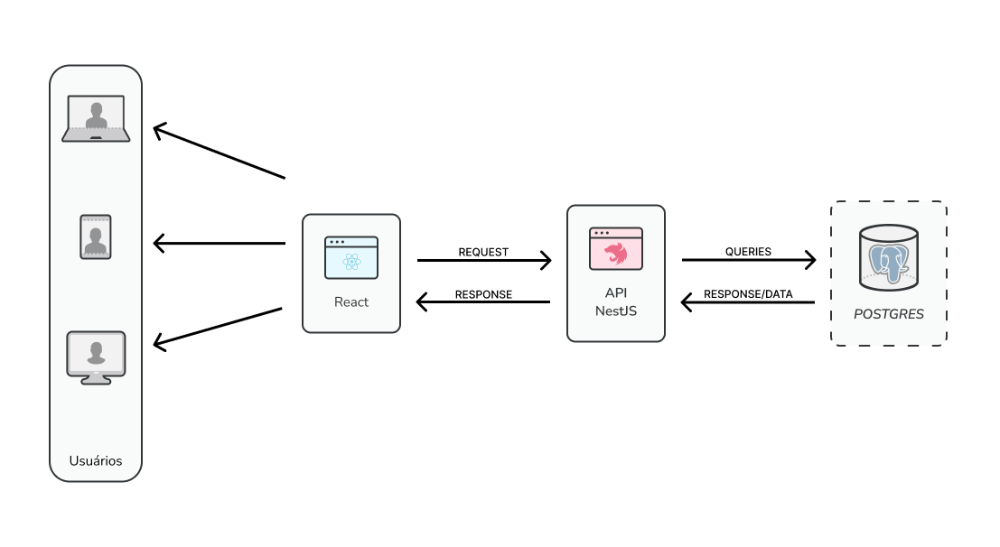

<h1>Documento de Arquitetura</h1>

<h2>Tecnologias de Apresentação: </h2>

<ul>
<li>Utilizaremos React + Typescript para desenvolver a interface do usuário. </li>
</ul>

<h2>Tecnologias de Negócios: </h2>

<ul>
<li>Utilizaremos Nestjs para desenvolver o backend da aplicação. </li>
</ul>

<h2>Tecnologias de Dados: </h2>

<ul style="margin-bottom: 60px;">
<li>Utilizaremos Postgres via supabase para armazenar os dados da aplicação. </li>
</ul>

<h3>Imagem representativa: </h3>  

