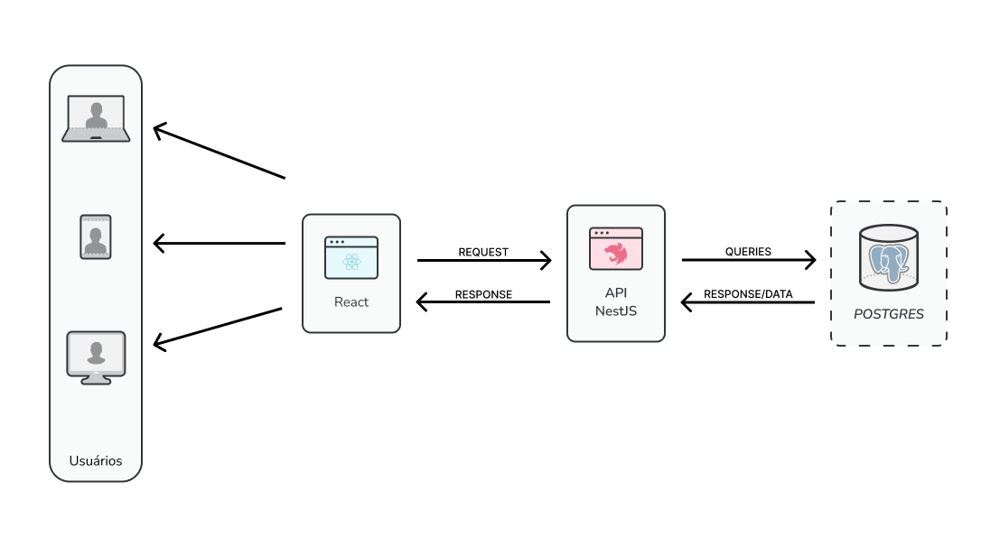
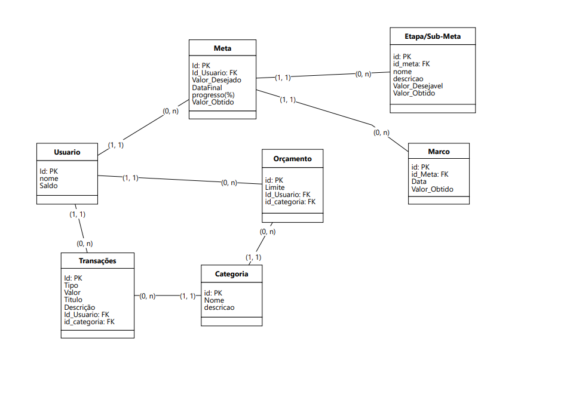

  <h1>Projeto e Prototipação</h1>

<h2>Documento de Arquitetura</h2>

<h3>Tecnologias de Apresentação: </h3>

<ul>
<li>Utilizaremos React + Typescript para desenvolver a interface do usuário. </li>
</ul>

<h3>Tecnologias de Negócios: </h3>

<ul>
<li>Utilizaremos Nestjs para desenvolver o backend da aplicação. </li>
</ul>

<h3>Tecnologias de Dados: </h3>

<ul style="margin-bottom: 60px;">
<li>Utilizaremos Postgres via supabase para armazenar os dados da aplicação. </li>
</ul>

<h2 style="margin-bottom: 60px;"><a href="https://trello.com/b/rRJM6sxG" target="_blank"><strong>Sprint Backlog</strong></a></h2>

<h2>Modelo de Dados</h2>

<h3>Diagrama de Dados (Lógico)</h3>

<h3><a href="https://www.figma.com/file/S2YIduEFrUhXukCl5XWJbu/Wireframe_FinnApp?type=design&node-id=0%3A1&mode=design&t=OHh0hbuhagdd3TUU-1">Wireframe</a></h3>

J

